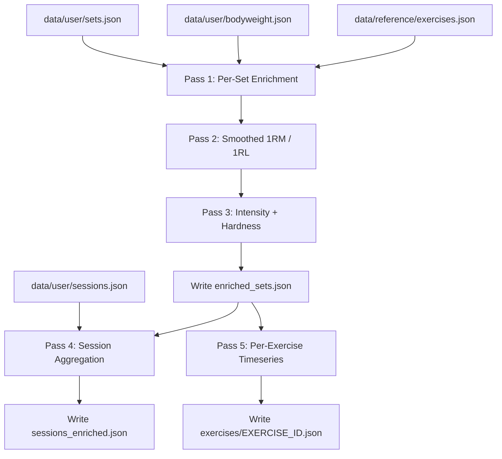
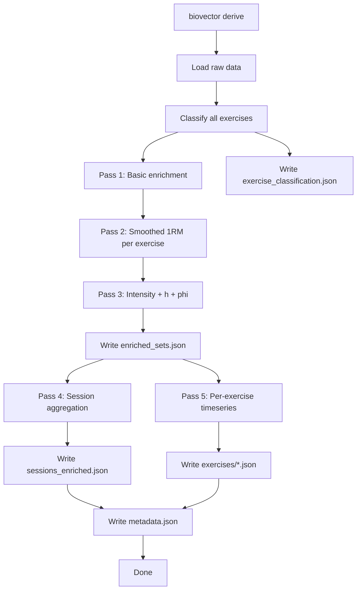

# Derived Data Pipeline — Design Document

> **Status**: Design  
> **Last updated**: 2026-04-11  
> **Author**: Biovector Architecture  

---

## 1. Overview

The derived data pipeline reads all raw biovector data and produces enriched, pre-computed JSON files in `data/derived/`. These files are **cache artifacts** — they can always be regenerated from raw data and should be `.gitignore`'d.

### Raw data sources

| File | Contents | Size |
|------|----------|------|
| `data/user/sets.json` | ~12K+ set records, 2018–2026 | ~1.9 MB |
| `data/user/sessions.json` | ~500+ session groupings | ~211 KB |
| `data/user/bodyweight.json` | ~250 BW measurements | ~48 KB |
| `data/reference/exercises.json` | ~120 exercise definitions with delta/rho/theta | ~37 KB |

### Pipeline architecture



---

## 2. Folder Structure

```
data/derived/
├── DESIGN.md                          # This document
├── enriched_sets.json                 # All sets with derived metrics
├── sessions_enriched.json             # Per-session aggregates
├── exercises/                         # Per-exercise timeseries
│   ├── S00_squat.json
│   ├── S10_front_squat.json
│   ├── P01.00_bench_press.json
│   ├── H00.0_deadlift.json
│   ├── P10.0_military_press.json
│   ├── T20.1_power_clean.json
│   ├── T00_chin_up.json
│   ├── P20_dips.json
│   └── ...                            # One file per exercise with >= 5 sets
├── metadata.json                      # Pipeline run metadata
└── exercise_classification.json       # Computed tier assignments
```

### File naming convention for exercises

`{exercise_id}_{snake_case_name}.json`

- Dots in IDs are preserved: `H00.0_deadlift.json`
- Name is lowercased with spaces replaced by underscores
- Only exercises with >= 5 sets in data get a timeseries file

### `metadata.json` schema

```json
{
  "generated_at": "2026-04-11T19:00:00Z",
  "pipeline_version": "1.0.0",
  "total_sets_processed": 12345,
  "total_sessions": 523,
  "total_exercises": 95,
  "exercises_with_timeseries": 42,
  "last_raw_set_timestamp": 1744300000,
  "smoothing_half_life_weeks": 52,
  "smoothing_floor_ratio": 0.75,
  "min_sessions_for_confidence": 3,
  "baseline_max_reps": 12
}
```

---

## 3. Per-Set Enrichment Schema

Each set in `enriched_sets.json` is the raw record plus all derived fields. The file structure:

```json
{
  "version": "1.0.0",
  "generated_at": "2026-04-11T19:00:00Z",
  "sets": [
    { "...enriched set record..." }
  ]
}
```

### Enriched set record

```json
{
  "_comment": "Example: Squat 140kg x 3 on 2026-04-07",

  "timestamp": 1744034400,
  "exercise_name": "Squat",
  "weight": 140.0,
  "reps": 3,
  "session_name": "A1",
  "notes": "",

  "date": "2026-04-07",
  "exercise_id": "S00",
  "exercise_tier": "major",
  "has_params": true,

  "bw_at_time": 99.0,
  "delta": 0.65,
  "kappa": 0.65,

  "load": 466.0,
  "pred_1rm": 154.0,
  "pred_1rl": 537.0,

  "smoothed_1rm": 155.0,
  "smoothed_1rl": 540.0,
  "smoothed_confidence": "high",

  "intensity": 0.99,
  "h": 1.04,
  "phi": 485.0,

  "is_hard_set": true,

  "session_id": "session_20260407_180000"
}
```

### Field definitions

| Field | Type | Description |
|-------|------|-------------|
| `timestamp` | float | Original unix timestamp |
| `exercise_name` | string | Original exercise name |
| `weight` | float | Weight in kg |
| `reps` | int | Repetitions performed |
| `session_name` | string | Optional session label |
| `notes` | string | Optional notes |
| `date` | string | ISO date derived from timestamp |
| `exercise_id` | string | ID from exercises.json, or `null` if not found |
| `exercise_tier` | string | One of: `major`, `secondary`, `accessory`, `bodyweight`, `other` |
| `has_params` | bool | Whether delta/rho/theta exist in exercises.json |
| `bw_at_time` | float | Interpolated bodyweight at timestamp |
| `delta` | float | Distance coefficient, or `null` |
| `kappa` | float | Body coefficient `rho * theta`, or `null` |
| `load` | float | `round(delta * weight + bw * kappa) * reps`, or `weight * reps` if no params |
| `pred_1rm` | float | `round(epley(weight, reps))` |
| `pred_1rl` | float | `round(epley(load/reps, reps))`, or `0.0` if no params |
| `smoothed_1rm` | float | Decay-weighted running maximum of pred_1rm |
| `smoothed_1rl` | float | Decay-weighted running maximum of pred_1rl |
| `smoothed_confidence` | string | `null`, `low`, or `high` — see section 5 |
| `intensity` | float | `pred_1rl / smoothed_1rl`, or `null` if no baseline |
| `h` | float | `logistic(intensity)`, or `null` if no baseline |
| `phi` | float | `round(load * h)`, or `null` if no baseline |
| `is_hard_set` | bool | `h >= 0.5`, or `false` if h is null |
| `baseline_fallback` | bool | True if this exercise's baseline used the all-sets fallback (no short sets) |
| `session_id` | string | Matched session ID from sessions.json, or `null` |

---

## 4. Per-Session Aggregation Schema

File: `sessions_enriched.json`

```json
{
  "version": "1.0.0",
  "generated_at": "2026-04-11T19:00:00Z",
  "sessions": [
    { "...enriched session record..." }
  ]
}
```

### Enriched session record

```json
{
  "id": "session_20260407_180000",
  "name": "A1",
  "date": "2026-04-07",
  "start_timestamp": 1744034400,
  "end_timestamp": 1744038000,
  "duration_minutes": 60,
  "bw_at_time": 99.0,

  "total_sets": 28,
  "exercise_count": 6,
  "exercises_performed": ["Squat", "Bench Press", "Chin Up", "Dips", "Ab Wheel", "Kettlebell Swing"],

  "per_exercise": {
    "Squat": {
      "sets": 5,
      "total_reps": 19,
      "total_load": 2200.0,
      "total_phi": 2100.0,
      "best_pred_1rm": 154.0,
      "hard_sets": 4.2,
      "avg_intensity": 0.92
    },
    "Bench Press": {
      "sets": 5,
      "total_reps": 21,
      "total_load": 1050.0,
      "total_phi": 980.0,
      "best_pred_1rm": 125.0,
      "hard_sets": 3.8,
      "avg_intensity": 0.88
    }
  },

  "totals": {
    "total_load": 5500.0,
    "total_hard_load": 4800.0,
    "total_hard_sets": 12.5,
    "total_hard_sets_major": 8.0,
    "volume_index": 285.0,
    "hard_volume_index": 249.0
  },

  "intensity_distribution": {
    "warmup_sets": 6,
    "moderate_sets": 4,
    "hard_sets": 15,
    "near_max_sets": 3
  }
}
```

### Field definitions — session level

| Field | Type | Description |
|-------|------|-------------|
| `id` | string | Session ID from sessions.json |
| `name` | string | Session name |
| `date` | string | ISO date |
| `start_timestamp` / `end_timestamp` | float | Session boundaries |
| `duration_minutes` | int | `round((end - start) / 60)` |
| `bw_at_time` | float | BW at session start |

### Field definitions — per_exercise within session

| Field | Type | Description |
|-------|------|-------------|
| `sets` | int | Number of sets |
| `total_reps` | int | Sum of reps |
| `total_load` | float | Sum of per-set load (ψ) |
| `total_phi` | float | Sum of per-set phi (φ) |
| `best_pred_1rm` | float | Max pred_1rm in session |
| `hard_sets` | float | Sum of h values (N) |
| `avg_intensity` | float | Mean intensity across sets, or `null` |

### Field definitions — totals

| Field | Type | Description |
|-------|------|-------------|
| `total_load` | float | Ψ — sum of all set loads |
| `total_hard_load` | float | Φ — sum of all phi |
| `total_hard_sets` | float | N — sum of all h |
| `total_hard_sets_major` | float | N restricted to major/secondary exercises |
| `volume_index` | float | `Ψ * bw^(-2/3)` |
| `hard_volume_index` | float | `Φ * bw^(-2/3)` |

### Intensity distribution

Categorize each set by its `h` value:

| Category | h range | Meaning |
|----------|---------|---------|
| `warmup_sets` | h < 0.1 | Warm-up / trivial |
| `moderate_sets` | 0.1 ≤ h < 0.5 | Moderate effort |
| `hard_sets` | 0.5 ≤ h < 1.02 | Hard working set |
| `near_max_sets` | h ≥ 1.02 | Near-maximal |

---

## 5. Smoothed 1RM Algorithm

This is the core algorithm that makes intensity-based metrics possible. It solves three problems simultaneously.

### 5.1 Problem statement

The naive approach — using `max(all pred_1rm)` as the reference — breaks because:

1. **Light sessions don't mean you got weaker**: A 100kg×5 session (pred_1rm=117) after a 140kg×3 session (pred_1rm=154) shouldn't reset 1RM to 117
2. **Old PRs should eventually decay**: A PR from 2 years ago shouldn't keep intensity artificially low forever
3. **New exercises have no history**: First appearance needs special handling

### 5.2 Algorithm: Exponentially Weighted Running Maximum (EWRM) with Decay-to-Floor

The algorithm uses a **decay-to-floor** model rather than decay-to-zero. This reflects the physiological reality that strength persists for years even without training — a lifter who squatted 150kg doesn't decay to 0kg; they retain a substantial fraction of that strength indefinitely.

For each exercise, processing sets in chronological order:

```
PARAMETERS:
  half_life = 52 weeks / 1 year (in seconds: 52 * 7 * 86400 = 31449600)
  floor_ratio = 0.75            # strength never decays below 75% of historical PR
  ceiling = 1 - floor_ratio     # = 0.25, the portion that decays
  min_sessions_for_confidence = 3

STATE per exercise:
  history_1rm: list of (timestamp, pred_1rm) tuples = []
  history_1rl: list of (timestamp, pred_1rl) tuples = []
  session_count: int = 0

FOR EACH SET (chronologically, within exercise):

  # 1. Compute raw predictions
  pred_1rm = epley(weight, reps)
  pred_1rl = epley(load / reps, reps)   # 0 if no load params

  # 2. Add current set to history
  IF pred_1rm > 0: history_1rm.append((timestamp, pred_1rm))
  IF pred_1rl > 0: history_1rl.append((timestamp, pred_1rl))

  # 3. Compute smoothed_1rm as max of all historical effective values
  #    Each historical PR decays toward floor_ratio of itself, not toward zero
  smoothed_1rm = 0.0
  FOR EACH (t_i, pr_i) IN history_1rm:
    age = timestamp - t_i
    decay = 2^(-(age) / half_life)
    effective = pr_i * (floor_ratio + ceiling * decay)
    smoothed_1rm = max(smoothed_1rm, effective)

  # Same for 1RL
  smoothed_1rl = 0.0
  FOR EACH (t_i, pr_i) IN history_1rl:
    age = timestamp - t_i
    decay = 2^(-(age) / half_life)
    effective = pr_i * (floor_ratio + ceiling * decay)
    smoothed_1rl = max(smoothed_1rl, effective)

  # 4. Track session count (increment when session_id changes)
  IF is_new_session:
    session_count += 1

  # 5. Determine confidence
  IF session_count == 0:
    confidence = null    # impossible, we're in a set
  ELIF session_count < min_sessions_for_confidence:
    confidence = "low"
  ELSE:
    confidence = "high"

  # 6. Compute intensity / hardness / phi
  IF smoothed_1rl > 0 AND confidence != null:
    intensity = pred_1rl / smoothed_1rl
    h = logistic(intensity)
    phi = round(load * h)
  ELSE:
    intensity = null
    h = null
    phi = null
```

### 5.3 Decay behavior examples

With half_life = 52 weeks (1 year) and floor_ratio = 0.75:

The formula for effective 1RM at time t after a PR:
`effective = PR × (0.75 + 0.25 × 2^(-t/52w))`

| Time since PR | Decay factor | Effective % | Old 1RM=154kg decays to |
|---------------|-------------|-------------|------------------------|
| 0 weeks | 1.000 | 100.0% | 154.0 |
| 4 weeks | 0.948 | 98.7% | 152.0 |
| 13 weeks (3mo) | 0.842 | 96.1% | 147.9 |
| 26 weeks (6mo) | 0.707 | 92.7% | 142.7 |
| 52 weeks (1yr) | 0.500 | 87.5% | 134.8 |
| 104 weeks (2yr) | 0.250 | 81.3% | 125.1 |
| 156 weeks (3yr) | 0.125 | 78.1% | 120.3 |
| ∞ | 0.000 | 75.0% | 115.5 |

This means: if you hit a 154kg squat and stop training, after 1 year the estimate is 135kg (not 77kg as the old model would give). After 3 years it's still 120kg. The floor ensures the estimate never drops below 75% of the PR — reflecting the physiological reality that trained strength persists for years.

### 5.4 Problem A — Light workouts

**Scenario**: Squat PR of 140×3 = 154kg pred_1rm. Next week, light session 100×5 = 117kg pred_1rm.

```
After PR:      smoothed_1rm = 154.0 (the PR itself, age=0, effective=154×(0.75+0.25×1.0)=154.0)
1 week later:  effective from PR = 154 * (0.75 + 0.25 * 2^(-1/52)) = 154 * 0.997 = 153.5
               effective from light set = 117 * (0.75 + 0.25 * 1.0) = 117.0
               smoothed_1rm = max(153.5, 117.0) = 153.5  ✓ Light session preserved estimate
```

Intensity of the light session: `pred_1rl / smoothed_1rl` will be low → h ≈ 0 → phi ≈ 0. Correct behavior.

### 5.5 Problem B — First-time exercises

- **Session 1**: `smoothed_1rm = pred_1rm` from best set. Confidence = `low`. Intensity/h/phi are computed but marked low-confidence.
- **Sessions 2–3**: Still `low` confidence, but estimates refine.  
- **Session 4+**: `high` confidence. Metrics are reliable.

While confidence is `low`, the intensity value is computed using the estimate so far. This is better than `null` — the user sees numbers from session 1, they just know the baseline is thin.

### 5.6 Problem C — Accessories where near-max never happens

For exercises like Kroc Rows where the user always does the same weight for high reps:

- `smoothed_1rm` reflects the running max Epley estimate for that exercise
- Intensity is self-referential: always relative to that exercise's own history
- If variance in weight used is tiny (coefficient of variation < 0.05), `smoothed_confidence` can optionally carry a flag like `"low_variance"` to indicate we've never truly tested limits
- This is acceptable: for accessories, the system still correctly computes load and phi

For bodyweight exercises (Chin Up, Dips):
- `weight` field represents **added weight** (0 for unassisted)
- `pred_1rm = epley(bw + added_weight, reps)`
- `load` uses the exercise's delta/rho/theta as normal since bodyweight is already factored in via kappa

### 5.7 Baseline eligibility — short sets only (r ≤ 12)

Epley's linear model is only calibrated in the low-rep range (≤ 10–12 reps).
Beyond that, prediction variance grows sharply, and since the smoothed baseline
is a **running maximum**, noisy high estimates from long sets can only push the
baseline upward — a systematic ratchet effect. Long sets also tend to appear
first for many accessory exercises, manufacturing an artificial baseline that
suppresses every future set's intensity (and with a 1-year half-life, the
damage persists for months).

Therefore, as of pipeline 1.1.0:

- The **official baseline** (`smoothed_1rm` / `smoothed_1rl`) is built only from
  sets with `reps ≤ 12` (Epley validity zone; `baseline_max_reps` in metadata).
- **Per-set `pred_1rm` / `pred_1rl` remain computed for every set** (pass 1,
  unchanged) — the habitual e1RM signal is preserved for post-processing and
  curve plotting (`1RM` = true singles, `e1RMs` = official short-set baseline,
  `e1RM` = habitual all-sets estimate).
- Every set — including long ones — is scored against the official baseline:
  a long set can be a hard set (h up to the logistic ceiling of 1.05) but can
  never raise the baseline.
- **Fallback**: an exercise with *no* short set in its entire history (e.g.
  grip work always logged at 15–20 reps) has no eligible baseline source. Its
  baseline is then built from all its sets, every set is flagged
  `baseline_fallback: true`, and `smoothed_confidence` is forced to `"low"`.
  The first short set switches the exercise back to the official layer.
- Sets performed before an exercise's first short set get `smoothed_* = 0.0`
  and no intensity/h/phi (no official baseline existed yet at that time).

---

## 6. Per-Exercise Timeseries Schema

One file per exercise in `data/derived/exercises/`.

### File structure

```json
{
  "exercise_name": "Squat",
  "exercise_id": "S00",
  "exercise_tier": "major",
  "has_params": true,
  "total_sets": 850,
  "total_sessions": 220,
  "date_range": {
    "first": "2018-02-12",
    "last": "2026-04-07"
  },
  "current_smoothed_1rm": 155.0,
  "current_smoothed_1rl": 540.0,
  "all_time_best_pred_1rm": 162.0,

  "session_series": [
    {
      "date": "2018-04-12",
      "session_id": "session_20180412_140009",
      "sets": 5,
      "best_weight": 130.0,
      "best_reps_at_best_weight": 1,
      "best_pred_1rm": 130.0,
      "smoothed_1rm": 130.0,
      "smoothed_1rl": 447.0,
      "total_load": 1800.0,
      "total_phi": 1650.0,
      "hard_sets": 3.5,
      "avg_intensity": 0.88
    }
  ]
}
```

### `session_series` entry fields

| Field | Type | Description |
|-------|------|-------------|
| `date` | string | ISO date of session |
| `session_id` | string | Session ID |
| `sets` | int | Number of sets of this exercise in session |
| `best_weight` | float | Heaviest weight used |
| `best_reps_at_best_weight` | int | Reps at that weight |
| `best_pred_1rm` | float | Highest pred_1rm in session |
| `smoothed_1rm` | float | Smoothed 1RM after this session |
| `smoothed_1rl` | float | Smoothed 1RL after this session |
| `total_load` | float | Sum of load for this exercise in session |
| `total_phi` | float | Sum of phi for this exercise in session |
| `hard_sets` | float | Sum of h |
| `avg_intensity` | float | Mean intensity, or null |

---

## 7. Exercise Classification

### Tier definitions

| Tier | Name | Criteria | Count |
|------|------|----------|-------|
| `major` | Program Lifts | Tracked in strength-states.json, have specific delta/kappa | 8 |
| `secondary` | Supporting Compounds | Barbell/significant compound movements with exercises.json entries | ~30 |
| `accessory` | Accessory Work | DB/KB/cable isolation, grip work, small movements | ~50 |
| `bodyweight` | Bodyweight-only | Exercises where weight=0 is standard, no external load typically | ~15 |
| `other` | Uncategorized | Exercises not in exercises.json | varies |

### Classification rules (evaluated in order)

```
1. IF exercise_name in MAJOR_LIST → "major"
2. IF exercise has exercises.json entry:
   a. IF type in ["Time", "Other"] AND id starts with ["C", "G", "L", "U"] → "accessory"
   b. IF type == "Bodyweight" AND no barbell variant AND typical weight == 0 → "bodyweight"
   c. IF type in ["Barbell", "Kettlebell"] AND not in accessory rules → "secondary"
   d. IF type in ["Dumbell", "Machine"] → "accessory"
   e. ELSE → "accessory"
3. IF exercise NOT in exercises.json → "other"
```

### Major exercises (hardcoded)

```json
[
  {"name": "Squat",         "id": "S00",    "abbrev": "SQ"},
  {"name": "Front Squat",   "id": "S10",    "abbrev": "FS"},
  {"name": "Bench Press",   "id": "P01.00", "abbrev": "BP"},
  {"name": "Deadlift",      "id": "H00.0",  "abbrev": "DL"},
  {"name": "Military Press", "id": "P10.0",  "abbrev": "MP"},
  {"name": "Power Clean",   "id": "T20.1",  "abbrev": "PC"},
  {"name": "Chin Up",       "id": "T00",    "abbrev": "CU"},
  {"name": "Dips",          "id": "P20",    "abbrev": "DP"}
]
```

### `exercise_classification.json` output

```json
{
  "version": "1.0.0",
  "generated_at": "2026-04-11T19:00:00Z",
  "classifications": {
    "Squat": {
      "id": "S00",
      "tier": "major",
      "has_params": true,
      "total_sets_in_data": 850,
      "total_sessions": 220
    },
    "Kroc Row": {
      "id": "T12.5",
      "tier": "accessory",
      "has_params": true,
      "total_sets_in_data": 180,
      "total_sessions": 85
    },
    "Tactical Stand Up": {
      "id": "X12",
      "tier": "accessory",
      "has_params": true,
      "total_sets_in_data": 5,
      "total_sessions": 3
    }
  }
}
```

---

## 8. Generation Pipeline Design

### Module location

`src/biovector/derived.py`

### Pipeline steps



### Pass descriptions

**Pass 1 — Basic enrichment**:
For each set in chronological order:
- Lookup exercise in exercises.json index
- Interpolate bodyweight at timestamp
- Compute `load`, `pred_1rm`, `pred_1rl`
- Assign `exercise_tier`, `exercise_id`, `has_params`
- Match to session via timestamp range lookup

**Pass 2 — Smoothed 1RM**:
Group sets by exercise. For each exercise, iterate chronologically:
- Run EWRM algorithm (section 5.2)
- Write `smoothed_1rm`, `smoothed_1rl`, `smoothed_confidence` back to each set

**Pass 3 — Intensity + hardness**:
For each set:
- If `smoothed_1rl > 0`: compute `intensity`, `h`, `phi`, `is_hard_set`
- Else: set all to `null` / `false`

**Pass 4 — Session aggregation**:
Group enriched sets by `session_id`. For each session:
- Compute per-exercise stats within session
- Compute session totals (Ψ, Φ, N)
- Compute volume indices
- Compute intensity distribution

**Pass 5 — Per-exercise timeseries**:
Group enriched sets by exercise. For each exercise with >= 5 sets:
- Group by session
- Extract per-session summary row
- Write timeseries file

### Implementation structure in `derived.py`

```python
class DerivedDataPipeline:

    def __init__(self, bv: Biovector):
        self.bv = bv
        self.enriched_sets: list[dict] = []
        self.classifications: dict[str, dict] = {}

    def run(self) -> None:
        self.classify_exercises()
        self.pass1_basic_enrichment()
        self.pass2_smoothed_1rm()
        self.pass3_intensity()
        self.write_enriched_sets()
        self.pass4_session_aggregation()
        self.pass5_exercise_timeseries()
        self.write_metadata()

    def classify_exercises(self) -> None: ...
    def pass1_basic_enrichment(self) -> None: ...
    def pass2_smoothed_1rm(self) -> None: ...
    def pass3_intensity(self) -> None: ...
    def pass4_session_aggregation(self) -> None: ...
    def pass5_exercise_timeseries(self) -> None: ...

    def write_enriched_sets(self) -> None: ...
    def write_metadata(self) -> None: ...
```

### CLI integration

Add to the existing biovector CLI:

```
biovector derive           # Full regeneration
biovector derive --force   # Force full recompute even if metadata exists
```

### Incremental mode

The pipeline checks `metadata.json`:
- If `last_raw_set_timestamp` matches the latest set in sets.json → skip (data is current)
- If new sets exist → **full rebuild** (because smoothed_1rm is path-dependent — changing history changes all subsequent values)

The full rebuild is acceptable because:
- 12K sets with simple math takes < 2 seconds
- JSON write of ~3MB is fast
- Correctness is more important than incremental speed

If performance becomes an issue in the future, a checkpoint system could store smoothed_1rm state per exercise at periodic snapshots, but this is premature optimization.

---

## 9. Edge Cases and Special Handling

### Bodyweight data gaps

The last BW measurement is April 2024. For all sets after that:
- The `get_user_weight_at()` method in `core.py` returns the last known value (99.0 kg)
- This is acceptable — BW doesn't change drastically week to week
- The design doc recommends adding new BW measurements to close this gap

### Exercises not in exercises.json

Some exercises in sets.json may not exist in exercises.json (imports from other apps, typos, etc.):
- `has_params = false`
- `load = weight * reps` (fallback)
- `pred_1rl = 0.0` (can't compute without delta/kappa)
- `intensity`, `h`, `phi` all `null`
- `exercise_tier = "other"`

### Zero-weight exercises

Some exercises use `weight: 0` (bodyweight holds, isometrics):
- `pred_1rm = 0.0` (meaningless)
- `load` still computed via kappa term if params exist
- `smoothed_1rm` tracks load-based values only for these

### Reps = 0 or negative weight

- Skip set from enrichment, preserve raw record with `null` derived fields
- Log a warning

### Single-rep sets

- `epley(w, 1) = w * (1 + 1/30) ≈ w * 1.033`
- Valid — the Epley formula handles single reps

### Very high-rep sets (> 30)

- Epley formula becomes inaccurate above ~12 reps
- Still compute `pred_1rm` but note it may overestimate
- The smoothed_1rm handles this naturally: high-rep light sets produce moderate pred_1rm that doesn't exceed the real max

---

## 10. Integration with Existing Code

### Compatibility with `Biovector` class

The pipeline uses `Biovector` as its data source:

```python
bv = Biovector()
pipeline = DerivedDataPipeline(bv)
pipeline.run()
```

It reads via:
- `bv.sets` — all raw sets
- `bv.sessions` — session definitions
- `bv.exercises` — exercise reference
- `bv.bodyweight` — BW measurements
- `bv.get_user_weight_at(ts)` — BW interpolation
- `bv.get_exercise(name)` — exercise lookup

It does **not** modify any raw data. All output goes exclusively to `data/derived/`.

### Relationship to `compute_set_metrics()`

The existing `Biovector.compute_set_metrics()` method in `core.py` computes a subset of what the pipeline produces (load, pred_1rm, pred_1rl, user_weight). The pipeline is a superset:

| Metric | core.py | Pipeline |
|--------|---------|----------|
| `load` | ✓ | ✓ |
| `pred_1rm` | ✓ | ✓ |
| `pred_1rl` | ✓ | ✓ |
| `user_weight` | ✓ | ✓ (as `bw_at_time`) |
| `smoothed_1rm` | ✗ | ✓ |
| `smoothed_1rl` | ✗ | ✓ |
| `intensity` | ✗ | ✓ |
| `h` | ✗ | ✓ |
| `phi` | ✗ | ✓ |
| `exercise_tier` | ✗ | ✓ |
| `session_id` | ✗ | ✓ |

The pipeline replaces and extends the on-the-fly computation for reporting/analysis. The on-the-fly method remains useful for live session logging where you need quick metrics for a single set.

### Legacy `workout.py` equivalence

The legacy `Workout.add_set()` used `max(all Pred1RM)` and `max(all Pred1RL)` as `est1RM`/`est1RL` — the all-time global maximum. The new smoothed approach is strictly better because it accounts for time decay. The smoothed value will always be <= the global max, making intensity values slightly higher (more sets count as "hard"), which is more realistic.
