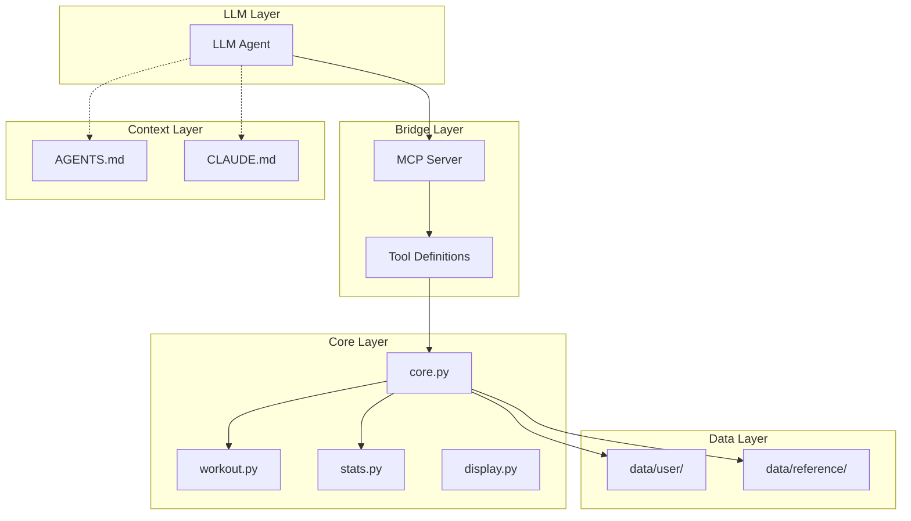
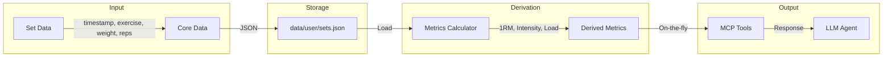

# Biovector Reorganization Plan

## Overview

Reorganize the biovector repository to create clear distinctions between:
- **User data** - Personal workout tracking data (sets, sessions)
- **Reference data** - Exercise definitions, program templates
- **Documentation** - Human-readable docs and analysis
- **Code** - Core Python modules
- **LLM Context** - Markdown files for AI agents
- **Bridge** - MCP server for LLM integration

## Target Directory Structure

```
biovector/
├── data/
│   ├── user/                      # User tracking data
│   │   ├── sets.json              # Core set data (migrated from CSV)
│   │   ├── sessions.json          # Auto-generated session groupings
│   │   └── bodyweight.json        # User bodyweight history
│   └── reference/                 # Reference data
│       ├── exercises.json         # Exercise definitions
│       └── programs/              # Program templates
│           ├── 531.yaml
│           └── monolith.yaml
├── src/biovector/
│   ├── __init__.py
│   ├── core.py                    # Renamed from bv_utils.py
│   ├── workout.py                 # Exercise/Workout classes
│   ├── stats.py                   # Statistics functions
│   ├── display.py                 # Renamed from printbv.py
│   └── config.yaml                # Configuration
├── bridge/
│   ├── __init__.py
│   ├── mcp_server.py              # MCP server implementation
│   └── tools.py                   # Tool definitions for MCP
├── context/
│   ├── AGENTS.md                  # Context for AI agents
│   ├── CLAUDE.md                  # Claude-specific instructions
│   └── exercises_context.md       # Exercise data in markdown
├── docs/
│   ├── metrics.md                 # Metrics documentation
│   └── analysis/                  # Analysis outputs
│       ├── heuristics_feedback.md
│       └── workout_stats.md
├── tests/
│   └── test_data_dir.py
├── pyproject.toml
└── README.md
```

## Data Model Transformation

### Current CSV Structure (19 columns)
```
Timestamp, Time, Number, Workout Name, Program, ID, Exercise Name, Weight, Reps, 
User Weight, Pred1RL, 1RL, Pred1RM, 1RM, Int, h, Load, phi, Notes
```

### New JSON Structure - Core Data Only

**sets.json** - Core set data:
```json
{
  "sets": [
    {
      "timestamp": 1518444054,
      "exercise_name": "Squat",
      "weight": 100.0,
      "reps": 7,
      "session_name": "1RM",
      "notes": ""
    }
  ]
}
```

**sessions.json** - Auto-generated sessions:
```json
{
  "sessions": [
    {
      "id": "session_20180212_150054",
      "start_timestamp": 1518444054,
      "end_timestamp": 1518444174,
      "name": "1RM",
      "auto_generated": false,
      "exercises": ["Squat", "Deadlift", "Bench Press"]
    }
  ]
}
```

### Derived Values (Auto-generated, not stored)

All derived values are calculated on-the-fly from core data:

| Metric | Formula | Description |
|--------|---------|-------------|
| **1RM** | `weight * (1 + reps/30)` | Epley formula |
| **Intensity** | `weight / 1RM` | Relative intensity |
| **Hard Set (h)** | `1.05 / (1 + e^(-40*(intensity-0.75)))` | Logistic function |
| **Load** | `weight * reps` | Volume load |
| **ψ (phi)** | `reps * (weight * Δ + mass * κ)` | Biovector load metric |

### Session Auto-splitting Algorithm

```python
def auto_split_sessions(sets, gap_hours=2):
    """
    Split sets into sessions based on timestamp gaps.
    
    Logic:
    1. If session_name exists and differs, use it
    2. If gap > gap_hours between consecutive sets, start new session
    3. Group sets by session
    """
    sessions = []
    current_session = []
    
    for i, set in enumerate(sorted(sets, key=lambda x: x.timestamp)):
        if i == 0:
            current_session.append(set)
            continue
            
        prev_set = sets[i-1]
        gap = set.timestamp - prev_set.timestamp
        
        # Check for explicit session name
        if set.session_name and set.session_name != prev_set.session_name:
            sessions.append(current_session)
            current_session = [set]
        # Check for time gap
        elif gap > gap_hours * 3600:
            sessions.append(current_session)
            current_session = [set]
        else:
            current_session.append(set)
    
    if current_session:
        sessions.append(current_session)
    
    return sessions
```

## Data Migration Tasks

### 1. Merge Multiple sets.csv Versions
- Compare `src/biovector/data/sets.csv` and `docs/sets.csv`
- Merge based on timestamp (primary key)
- Use more precise values from docs/sets.csv where available

### 2. Convert to JSON Format
- Extract core fields: timestamp, exercise_name, weight, reps
- Preserve optional fields: session_name, notes
- Discard derived fields (will be auto-generated)

### 3. Auto-split Sessions
- Apply session splitting algorithm
- Generate sessions.json with session metadata

## MCP Server Tools

### Core Tools
| Tool | Description | Parameters |
|------|-------------|------------|
| `add_set` | Log a new exercise set | exercise_name, weight, reps, session_name?, notes? |
| `get_workout_history` | Get workout history | exercise_name?, date_range?, limit? |
| `get_exercise_stats` | Get exercise statistics | exercise_name, period? |
| `get_1rm_progression` | Track 1RM over time | exercise_name, date_range? |
| `get_session` | Get session details | session_id or date |
| `list_exercises` | List available exercises | category?, search? |
| `get_program` | Get program template | program_name |

### Resources
| Resource | Description |
|----------|-------------|
| `exercises://all` | All exercise definitions |
| `programs://{name}` | Program template by name |
| `sessions://recent` | Recent workout sessions |

## Files to Delete

- `src/biovector/__main__.py` - CLI entry point
- `src/biovector/interactive.py` - Interactive CLI
- `main.py` - Root main file
- `lib/` - Empty directory
- `docs/sets.csv` - Duplicate data (merged into sets.json)
- `src/biovector/data/.swap.csv` - Swap file
- `__marimo__/` - Marimo cache
- `src/biovector.egg-info/` - Build artifact
- `analysis.py` - Moved to docs/analysis/

## Files to Rename/Move

| Current | New Location |
|---------|--------------|
| `src/biovector/bv_utils.py` | `src/biovector/core.py` |
| `src/biovector/printbv.py` | `src/biovector/display.py` |
| `src/biovector/data/sets.csv` | `data/user/sets.json` |
| `src/biovector/data/workouts.csv` | `data/user/sessions.json` |
| `src/biovector/data/exercises.csv` | `data/reference/exercises.json` |
| `src/biovector/data/programs/` | `data/reference/programs/` |
| `analysis.py` | `docs/analysis/analysis.py` |

## Implementation Order

1. **Create new directory structure**
   - `data/user/`, `data/reference/`, `bridge/`, `context/`

2. **Data migration**
   - Merge sets.csv versions
   - Convert to JSON with core fields only
   - Auto-split sessions
   - Create sessions.json

3. **Code reorganization**
   - Rename bv_utils.py → core.py
   - Rename printbv.py → display.py
   - Update all imports

4. **Delete CLI code**
   - Remove __main__.py, interactive.py, main.py

5. **Create MCP bridge**
   - Implement mcp_server.py
   - Define tools in tools.py

6. **Create LLM context**
   - AGENTS.md, CLAUDE.md
   - exercises_context.md

7. **Cleanup**
   - Delete obsolete files/directories
   - Update pyproject.toml
   - Update config.yaml

## Architecture Diagram



## Data Flow Diagram


