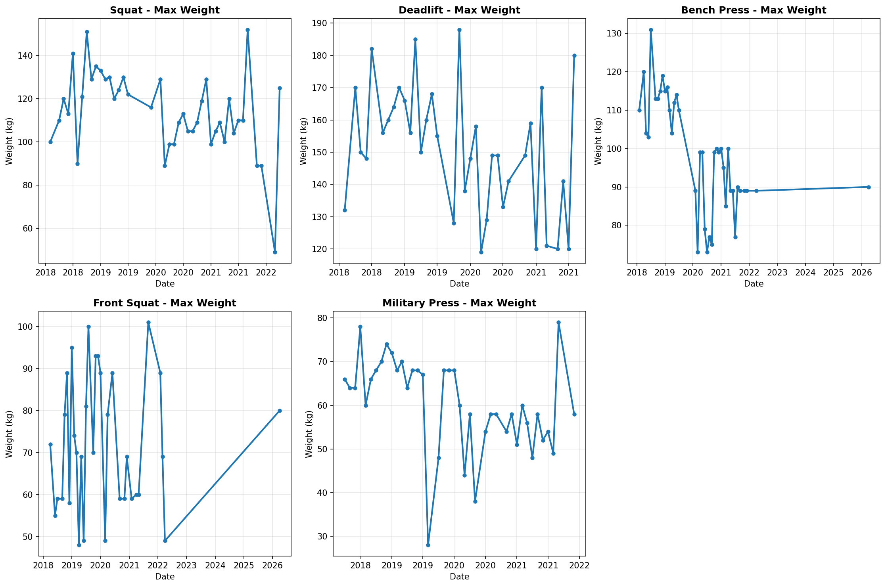
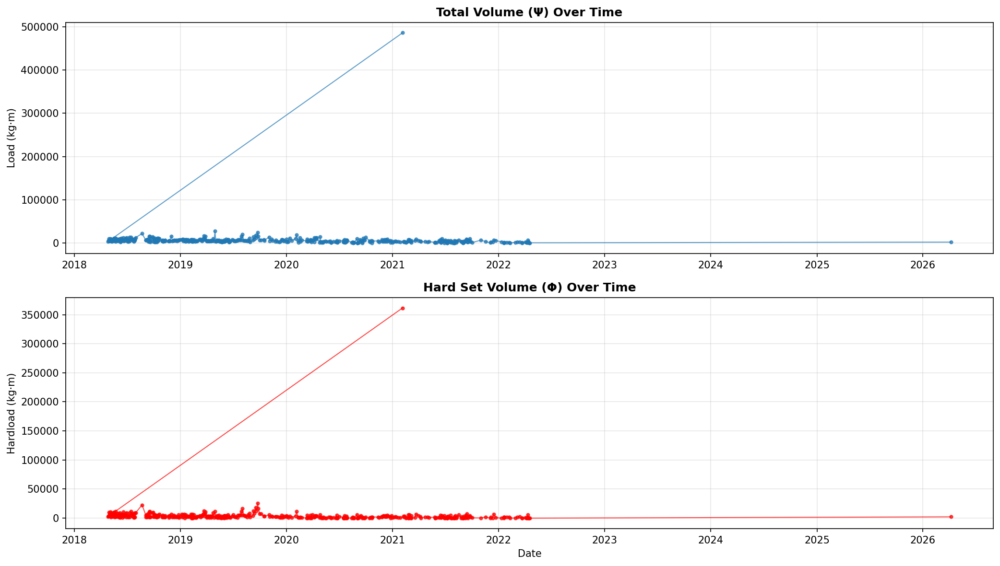
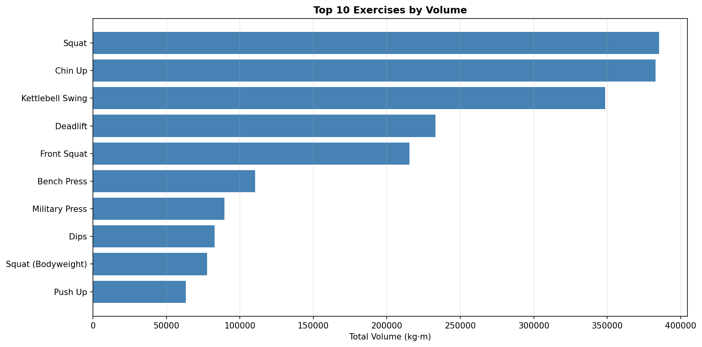

# Biovector Training Report

**Data range:** 2018-02-12 to 2026-04-07 (2975 days)

## Summary Stats

- **Total Volume (Ψ):** 3,044,649 kg·m
- **Total Hardload (Φ):** 1,840,357 kg·m
- **Workouts:** 456
- **Sets:** 10779

## Recent Workouts

| Date | Hardsets | Load | Hardload |
|---|---|---|---|
| 2026-04-07 | 11.6 | 2,130 | 2,234 |
| 2022-04-17 | 0.0 | 539 | 1 |
| 2022-04-15 | 0.3 | 583 | 64 |
| 2022-04-13 | 0.0 | 3,080 | 15 |
| 2022-04-12 | 0.1 | 1,301 | 21 |

## Charts

---
*Generated on 2026-04-08 02:40*
