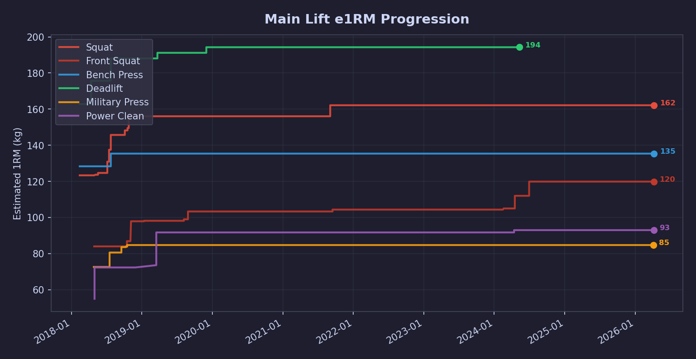
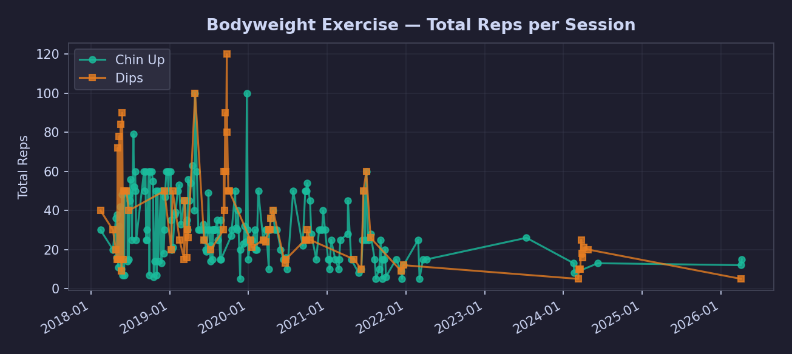
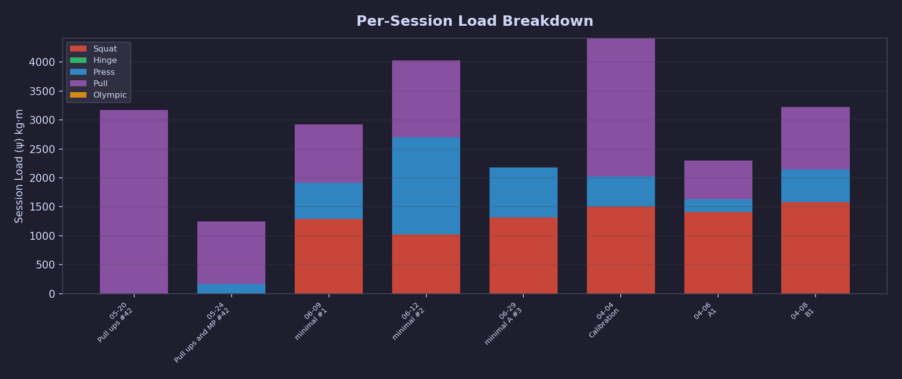
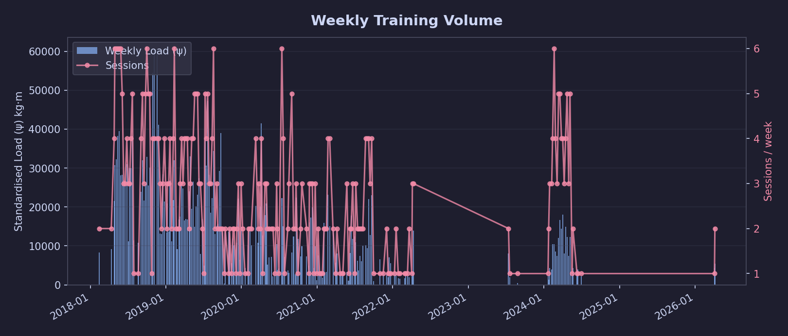
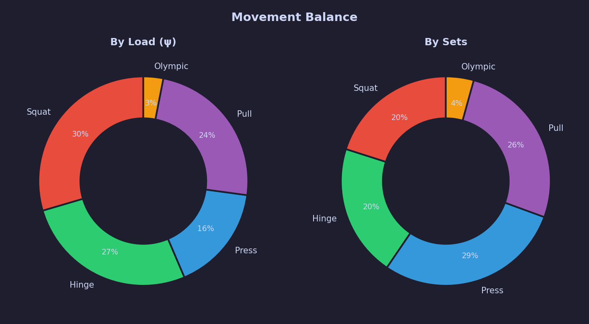

# 🏋️ Training Report — Detailed

> **Generated:** 2026-04-11 19:19  
> **Data range:** 2018-02-12 → 2026-04-08  
> **Sessions:** 556 · **Sets:** 8182 · **Filter:** Tier 1+2

---

## 📋 Current Program State

**Next session:** `C1`  
**Last updated:** 2026-04-10

| Exercise | Load | State | | Exercise | Load | State |
|----------|------|-------|-|----------|------|-------|
| **SQ** | 100 kg | `S2` | | **FS** | 80 kg | `S0p` |
| **BP** | 70 kg | `S2` | | **DL** | 130 kg | `D0` |
| **MP** | 60 kg | `S0` | | **PC** | 60 kg | `P0p` |

🎯 **Chins target:** 15 · **Dips target:** 12

---

## 📈 Main Lift Progression

| Exercise | Best Weight | Best e1RM | Sets | Period |
|:---------|:----------:|:---------:|:----:|:------:|
| **Squat** | 152 kg | 162 kg | 772 | 2018-02-12 → 2026-04-08 |
| **Front Squat** | 116 kg | 120 kg | 470 | 2018-04-28 → 2026-04-06 |
| **Bench Press** | 131 kg | 135 kg | 688 | 2018-02-12 → 2026-04-08 |
| **Deadlift** | 188 kg | 194 kg | 630 | 2018-02-12 → 2024-05-09 |
| **Military Press** | 79 kg | 85 kg | 646 | 2018-04-26 → 2026-04-04 |
| **Power Clean** | 90 kg | 93 kg | 192 | 2018-04-30 → 2026-04-06 |
| **Chin Up** | 62 kg | 64 kg | 907 | 2018-02-14 → 2026-04-08 |
| **Dips** | 40 kg | 47 kg | 263 | 2018-02-14 → 2026-04-04 |

---

## 💪 Supporting Exercises

| Exercise | Best Weight | Best e1RM | Sets | Total Reps |
|:---------|:----------:|:---------:|:----:|:----------:|
| Kettlebell Swing | 56 kg | 139 kg | 496 | 6139 |
| Bent Over Row | 89 kg | 108 kg | 287 | 1486 |
| Close Grip Bench Press | 115 kg | 119 kg | 214 | 1446 |
| Kroc Row | 82 kg | 92 kg | 208 | 1387 |
| Push Press | 90 kg | 93 kg | 177 | 634 |
| Push Up | 20 kg | 24 kg | 161 | 1908 |
| Kettlebell Turkish Get Up | 32 kg | 34 kg | 159 | 211 |
| Pull Up | 24 kg | 30 kg | 158 | 1288 |
| Romanian Deadlift | 110 kg | 128 kg | 122 | 517 |
| Good Morning | 62 kg | 80 kg | 114 | 533 |
| Snatch Grip Deadlift | 150 kg | 155 kg | 93 | 511 |
| Pistol Squat | 0 kg | 0 kg | 86 | 417 |
| Upright Row (Barbell) | 54 kg | 72 kg | 86 | 734 |
| Squat (Bodyweight) | 0 kg | 0 kg | 85 | 1320 |
| Power Snatch (Barbell) | 70 kg | 72 kg | 83 | 97 |
| Australian Pull Up | 0 kg | 0 kg | 79 | 636 |
| High Bar Squat | 79 kg | 105 kg | 79 | 361 |
| Ring Dips | 0 kg | 0 kg | 68 | 528 |
| Pendlay Row | 100 kg | 117 kg | 62 | 255 |
| Zercher Goodmorning | 129 kg | 133 kg | 61 | 395 |
| Unilateral Kettlebell Swing | 32 kg | 104 kg | 55 | 775 |
| Jump Squat | 56 kg | 65 kg | 44 | 419 |
| Nordic Hamstring Curl (Assisted) | 30 kg | 45 kg | 43 | 218 |
| Deficit Deadlift | 42 kg | 50 kg | 40 | 145 |
| Clean and Jerk (Barbell) | 80 kg | 83 kg | 39 | 82 |
| Hang Clean (Barbell) | 70 kg | 72 kg | 38 | 110 |
| Kettlebell Snatch | 32 kg | 37 kg | 36 | 193 |
| A9 | 0 kg | 0 kg | 33 | 367 |
| Zercher Squat (Barbell) | 95 kg | 111 kg | 33 | 172 |
| Wide Pull Up | 0 kg | 0 kg | 30 | 204 |
| Pin Bench (Top Half) | 127 kg | 131 kg | 29 | 33 |
| Bulgarian Split Squat | 69 kg | 76 kg | 24 | 153 |
| Sumo Deadlift | 48 kg | 58 kg | 24 | 84 |
| Goblet Squat | 56 kg | 65 kg | 22 | 146 |
| Inverted Row (Bodyweight) | 0 kg | 0 kg | 20 | 505 |
| Hip Thrust (Barbell) | 120 kg | 140 kg | 19 | 165 |
| Seated Overhead Press (Barbell) | 66 kg | 69 kg | 17 | 79 |
| Snatch (Barbell) | 60 kg | 62 kg | 16 | 25 |
| Kneeling Landmine Press | 50 kg | 63 kg | 15 | 142 |
| Unilateral T-Bar Row | 60 kg | 66 kg | 15 | 67 |
| Bench Press (Dumbbell) | 40 kg | 53 kg | 13 | 127 |
| Hanging Inverted Row | 0 kg | 0 kg | 12 | 39 |
| Seated Cable Row | 113 kg | 132 kg | 12 | 72 |
| Safety Bar Squat | 90 kg | 101 kg | 11 | 76 |
| Dumbbell Snatch | 16 kg | 21 kg | 10 | 55 |
| Klokov Press | 30 kg | 40 kg | 10 | 100 |
| Trap Bar Deadlift | 140 kg | 163 kg | 9 | 75 |
| One Arm Push Up | 0 kg | 0 kg | 8 | 29 |
| One Arm Chin Up (assisted) | 23 kg | 24 kg | 7 | 9 |
| Deadlift High Pull (Barbell) | 88 kg | 91 kg | 7 | 19 |
| Z Press | 49 kg | 57 kg | 6 | 75 |
| Thruster (Barbell) | 40 kg | 51 kg | 6 | 48 |
| Chest Supported T-Bar Row | 50 kg | 58 kg | 6 | 45 |
| Overhead Squat | 28 kg | 37 kg | 6 | 90 |
| Nordic Hamstring Curl (Eccentric) | 0 kg | 0 kg | 5 | 15 |
| One Arm Chinup (Eccentric) | 0 kg | 0 kg | 5 | 19 |
| Rope Climb (legless) | 0 kg | 0 kg | 5 | 5 |
| T Bar Row | 50 kg | 67 kg | 3 | 32 |
| Ring Push Up | 0 kg | 0 kg | 3 | 30 |

---

## 🗓️ Recent Sessions

### **2026-04-08** — B1

| Exercise | Sets |
|:---------|:-----|
| Squat | `100.0×3, 100.0×3, 100.0×6` |
| Bench Press | `70.0×3, 70.0×3, 70.0×10` |
| Chin Up | `0.0×7, 0.0×5, 0.0×3` |

### **2026-04-06** — A1

| Exercise | Sets |
|:---------|:-----|
| Power Clean | `60.0×1, 60.0×1, 60.0×1, 60.0×1, 60.0×1` |
| Front Squat | `80.0×3, 80.0×3, 80.0×5` |
| Bench Press | `90.0×1, 90.0×3, 90.0×1` |

### **2026-04-04** — Calibration

| Exercise | Sets |
|:---------|:-----|
| Squat | `90.0×4, 90.0×4, 90.0×4` |
| Power Clean | `50.0×5, 50.0×5, 50.0×3` |
| Military Press | `50.0×9` |
| Chin Up | `0.0×7, 0.0×5` |
| Dips | `0.0×5` |

### **2024-06-29** — minimal A #3

| Exercise | Sets |
|:---------|:-----|
| Front Squat | `96.0×3, 106.0×1, 116.0×1` |
| Squat | `126.0×3, 136.0×1` |
| Bench Press | `56.0×10, 86.0×5, 96.0×3, 106.0×3, 120.0×1` |

### **2024-06-12** — minimal #2

| Exercise | Sets |
|:---------|:-----|
| Power Clean | `50.0×5, 70.0×5` |
| Bench Press | `50.0×20, 100.0×5, 100.0×4, 86.0×8, 76.0×10` |
| Front Squat | `80.0×8` |

### **2024-06-09** — minimal #1

| Exercise | Sets |
|:---------|:-----|
| Front Squat | `76.0×5, 86.0×5` |
| Bench Press | `74.0×5, 84.0×5, 94.0×5` |
| Chin Up | `0.0×10, 32.0×2, 32.0×1` |

### **2024-05-24** — Pull ups and MP #42

| Exercise | Sets |
|:---------|:-----|
| Pull Up | `0.0×10, 0.0×5` |
| Military Press | `48.0×5` |

### **2024-05-20** — Pull ups #42

| Exercise | Sets |
|:---------|:-----|
| Pull Up | `0.0×12, 0.0×10, 0.0×22` |

---

## 📊 Volume Trends

Weekly data table

| Week | Load (ψ) | Sessions | Avg load/session |
|:-----|:--------:|:--------:|:----------------:|
| 2024-W07 | 10,424 | 4 | 2,606 |
| 2024-W08 | 10,436 | 6 | 1,739 |
| 2024-W09 | 8,572 | 4 | 2,143 |
| 2024-W10 | 7,455 | 3 | 2,485 |
| 2024-W11 | 12,063 | 5 | 2,413 |
| 2024-W12 | 16,720 | 5 | 3,344 |
| 2024-W13 | 14,433 | 4 | 3,608 |
| 2024-W14 | 18,097 | 4 | 4,524 |
| 2024-W15 | 8,100 | 3 | 2,700 |
| 2024-W16 | 14,911 | 4 | 3,728 |
| 2024-W17 | 12,240 | 5 | 2,448 |
| 2024-W18 | 7,433 | 3 | 2,478 |
| 2024-W19 | 12,358 | 5 | 2,472 |
| 2024-W20 | 2,375 | 1 | 2,375 |
| 2024-W21 | 4,257 | 2 | 2,128 |
| 2024-W23 | 2,858 | 1 | 2,858 |
| 2024-W24 | 3,993 | 1 | 3,993 |
| 2024-W26 | 2,153 | 1 | 2,153 |
| 2026-W14 | 4,322 | 1 | 4,322 |
| 2026-W15 | 5,413 | 2 | 2,707 |

---

## ⚖️ Movement Balance

| Category | Sets | Load (ψ) | % |
|:---------|:----:|:--------:|:-:|
| **Squat** | 1632 | 872,009 | 29.6% `█████░░░░░░░░░░░░░░░` |
| **Hinge** | 1663 | 791,768 | 26.8% `█████░░░░░░░░░░░░░░░` |
| **Press** | 2351 | 484,707 | 16.4% `███░░░░░░░░░░░░░░░░░` |
| **Pull** | 2139 | 710,409 | 24.1% `████░░░░░░░░░░░░░░░░` |
| **Olympic** | 349 | 90,337 | 3.1% `░░░░░░░░░░░░░░░░░░░░` |

---

> *⚠️ Tier 3 exercises (grip, core, arm isolation) excluded from all aggregations.*  
> *Generated by `reports/generate_report.py` on 2026-04-11 19:19*